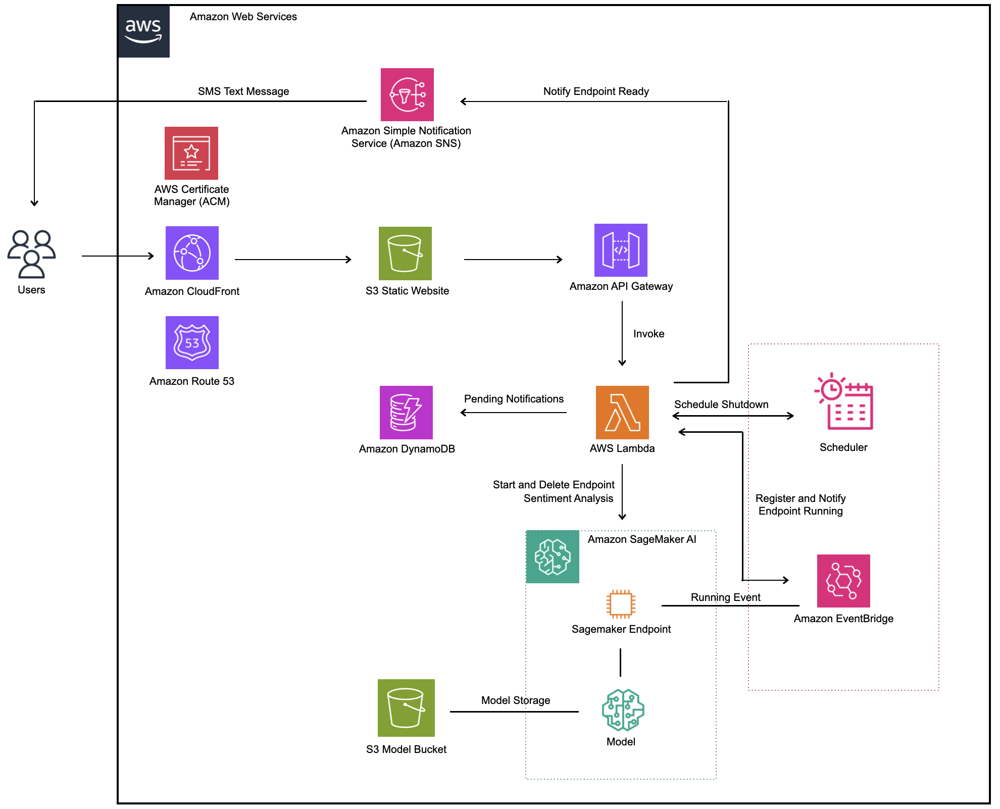
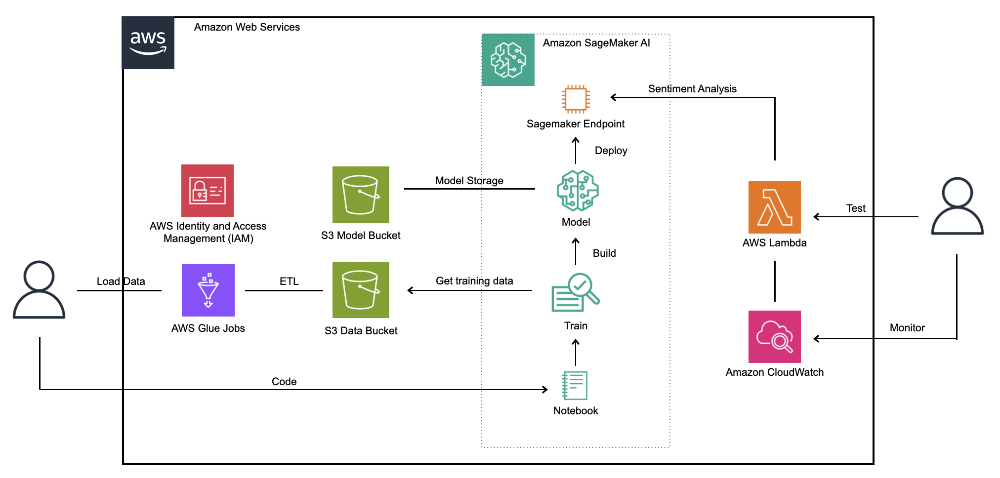
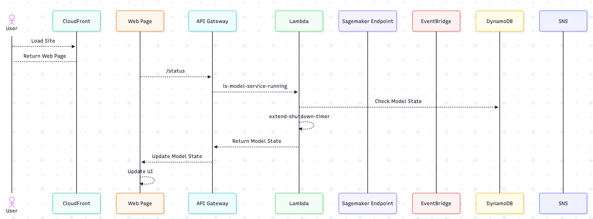
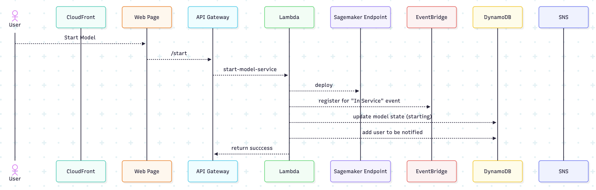
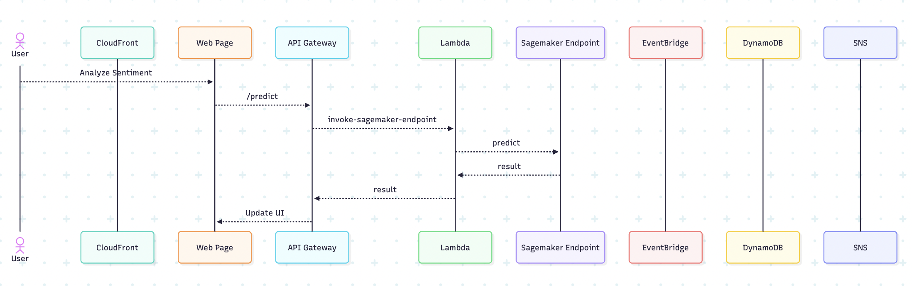
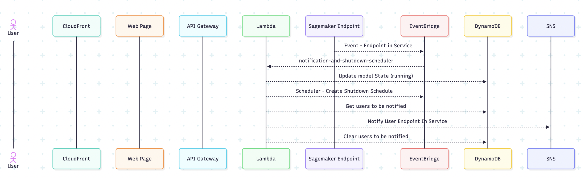
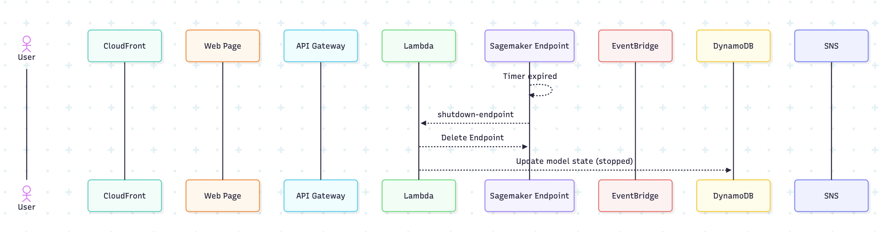

# sentiment-analysis
## An On-Demand Sentiment Analysis Engine (AWS Serverless MLOps)

---

## Project Overview

This project is a complete, end-to-end MLOps system that deploys a sentiment analysis model in a cost-effective, on-demand, and serverless manner. A user can visit the web application, start the model with the click of a button, and receive an SMS notification when it's ready. The model then automatically shuts down after 30 minutes to minimize costs.

The core of the project is a DistilBERT model, fine-tuned on the Amazon Customer Reviews dataset, capable of classifying text as POSITIVE or NEGATIVE. The entire infrastructure is built on AWS and features an event-driven architecture.

**Live Demo:** `https://www.bobseamon.com/sentiment.html`

---

## Architecture Diagram

This diagram illustrates the two main workflows: the on-demand startup/shutdown cycle and the prediction pipeline.

### Runtime Architecture

### Development and Monitoring Components

---

## Tech Stack

* **Cloud Provider:** Amazon Web Services (AWS)
* **Machine Learning:** Amazon SageMaker AI (Training Jobs, Endpoints)
* **Serverless Compute:** AWS Lambda
* **API Layer:** Amazon API Gateway
* **Database / State Management:** Amazon DynamoDB
* **Event-Driven Messaging & Automation:** Amazon EventBridge (Rules & Scheduler), Amazon SNS / Textbelt API
* **Data Lake & Storage:** AWS S3
* **ETL & Data Processing:** AWS Glue
* **Web Application:** Streamlit/Javascript
* **Web App Hosting:** S3
* **Content Distribution** CloudFront
* **Domain and DNS** Route 53
* **Programming Language:** Python, Javascript
* **Key Libraries:** Boto3, Pandas, PyTorch, Hugging Face (Transformers, Datasets), Requests

---

## Project Highlights & Key Learnings

This project demonstrates a wide range of MLOps and cloud architecture skills:

* **Cost Optimization:** Implemented an on-demand system where the expensive SageMaker GPU endpoint only runs when requested by a user, and automatically shuts down after 30 minutes, drastically reducing operational costs by 95 - 99%.
* **Event-Driven Architecture:** Utilized Amazon EventBridge to create a decoupled system that reacts to events (like a SageMaker endpoint becoming `InService`) to trigger downstream actions like user notifications and scheduled shutdowns.
* **Stateful Serverless Design:** Managed system state (e.g., `CREATING`, `IN_SERVICE`, `STOPPED`) and handled concurrency using Amazon DynamoDB, preventing race conditions and ensuring a robust experience for multiple simultaneous users.
* **Full ML Lifecycle Management:** Executed the complete MLOps lifecycle from data ingestion (S3), ETL (Glue), model training (SageMaker), and deployment (SageMaker Endpoint) to creating a user-facing API (API Gateway & Lambda) and a web frontend (Streamlit for development, Javascript for deployment).
* **Third-Party API Integration:** Integrated the Textbelt API for sending SMS notifications, demonstrating the ability to connect AWS services with external systems.

---

## Use Cases

### Query Sagemaker Endpoint to see if it is running

As a User, since the Sagemaker Endpoint is not running 24/7, when I come to the sentiment analysis web page, I want to know whether or not the SageMaker endpoint is running.  If it is running, I want to ensure that it will stay running while I perform some sentiment analysis queries.

#### Sequence Diagram

### Start the Sagemaker Endpoint

As a User, if the Sagemaker Endpoint is not running 24/7, I want to be able to start the Sagemaker Endpoint.  Since the start process isn't immediate, I want to be notified by a SMS text message when it is up and running.

#### Sequence Diagram

### Predict - Sentiment Analysis

As a User, I want to be able to submit a text message to be able to predict its sentiment of either positive or negative

#### Sequence Diagram

### Event - Sagemaker Endpoint In Service

As a User, I want to be notified when the Sagemaker Endpoint becomes ready to use.  Since the Sagemaker endpoint does not need to be used continuously, I want to schedule it to shut down after 30 minutes.

#### Sequence Diagram

### Event - Timer Expired

From a System's Admin perspective, I want the Sagemaker Endpoint to be shut down after 30 minutes of inactivity.  If the endpoint is only used once or twice a day, this will save me about 96% in operating costs vs. running the Sagemaker Endpoint 24/7.

#### Sequence Diagram

---

## Setup & Usage

### Prerequisites

* An AWS Account with appropriate permissions
* AWS CLI configured locally (`aws configure`)
* Python 3.10+ and `pip`
* A Textbelt API Key

### Backend Setup

1.  **IAM Roles:** Create the necessary IAM Roles for Glue, SageMaker, and Lambda as detailed in the project's development history.
2.  **Data Processing:** Run the AWS Glue job to process the raw data, and `Data-Exploration.ipynb` to explore the processed data.
3.  **Model Training:** Use the `Train-Deploy-Model.ipynb` notebook to launch the SageMaker Training Job. This will create the trained model artifact in S3.
4.  **Serverless Backend:**
    * Create the `SentimentModelState` DynamoDB table and populate the initial item.
    * Deploy the six Lambda functions (`is-model-service-running`, `start-model-service`, etc.) and configure their environment variables.
    * Set up the API Gateway with `/status`, `/start`, and `/predict` endpoints.
    * Create the EventBridge rule to watch for SageMaker endpoint status changes.

### Frontend Setup (Local)

1.  Clone the repository: `git clone <your-repo-url>`
2.  Navigate to the project directory: `cd <your-project-directory>`
3.  Install dependencies: `pip install -r requirements.txt`
4.  Update the `API_GATEWAY_URL` in `app.py` with your deployed URL.
5.  Run the Streamlit app: `streamlit run app.py`
